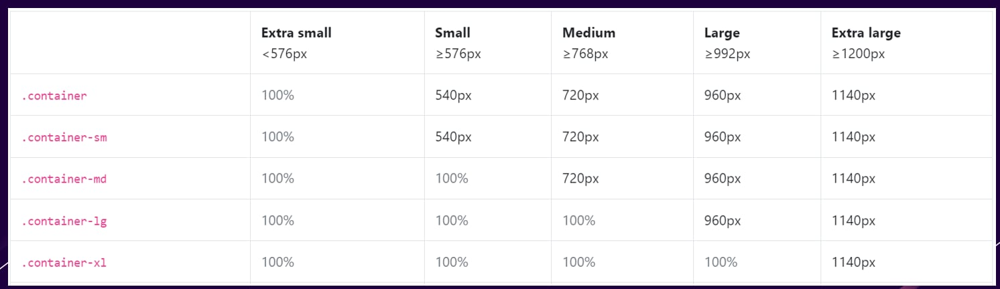
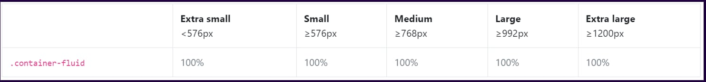
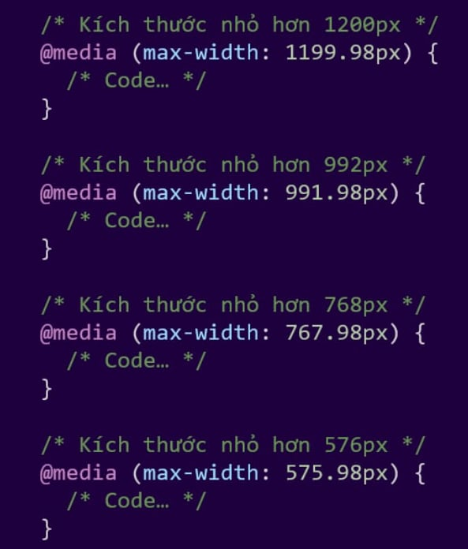
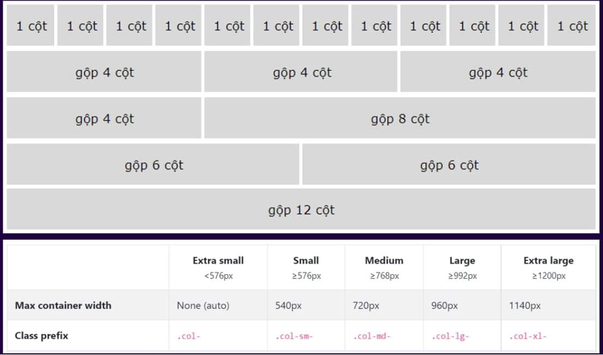

## Font-awesome
**Link libraries:** https://cdnjs.com/libraries/font-awesome/6.3.0

**Copy dòng đầu và Paste vào <head> của file html** 

**Link lấy icon:** https://fontawesome.com/search

## Bootstrap
**Link Bootstrap:** https://getbootstrap.com/docs/4.6/getting-started/introduction/

## Container

## Container Fluid

## PC first

## Grid

